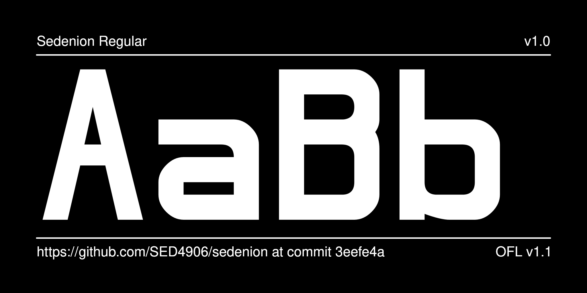
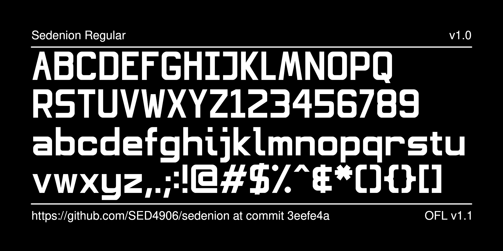

# Sedenion

A font created for the ComposiTV project, used in the logo and the Commute user interface.

Ironically, multiplication of sedenions is neither commutative, associative, nor alternative.

## About

ComposiTV is a project to build a more useful Smart TV.

## Building

Fonts are built with Fontforge.

If you want to build extra data manually on your own computer:

* `make test` will run [FontBakery](https://github.com/googlefonts/fontbakery)'s quality assurance tests.
* `make proof` will generate HTML proof files.

## Changelog

**2025-05-01. Version 1.00**
- Initial release

## License

This Font Software is licensed under the SIL Open Font License, Version 1.1.
This license is available with a FAQ at https://openfontlicense.org
